# Scale-to-Zero Application Design Document

## 📚 Application Overview

The scale-to-zero application is a sophisticated Kubernetes controller that automatically scales services to zero when idle and instantly scales them back up when traffic arrives. It uses **eBPF** for high-performance packet interception and features **dependency-aware scaling** with **HPA lifecycle management**.

### Key Features
- **eBPF XDP packet interception** for microsecond-level response times
- **Dependency-aware scaling** with parent-child relationships
- **HPA lifecycle management** with delete/recreate strategy
- **Priority-based scaling** for proper ordering
- **Zero-copy packet processing** in kernel space
- **Kubernetes-native** with annotation-driven configuration

## 🏗️ Overall Architecture


## 🔍 Packet Processing Flow


## 🚀 Service Discovery & Configuration


### Service Annotations

The application is configured through Kubernetes service annotations:

```yaml
apiVersion: v1
kind: Service
metadata:
  name: gateway
  annotations:
    # Basic scale-to-zero configuration
    scale-to-zero/scale-down-time: "60"              # Idle timeout in seconds
    scale-to-zero/reference: "deployment/gateway"    # Target workload
    
    # HPA configuration for delete/recreate
    scale-to-zero/hpa-enabled: "true"               # Enable HPA management
    scale-to-zero/min-replicas: "2"                 # HPA min replicas
    scale-to-zero/max-replicas: "5"                 # HPA max replicas
    scale-to-zero/target-cpu-utilization: "60"      # CPU target percentage
    
    # Parent-child dependency configuration
    scale-to-zero/dependencies: "user-service,product-service"  # Children
    scale-to-zero/scaling-priority: "10"            # Explicit priority (optional)
```

## 🔄 Dependency-Aware Traffic Processing


### Critical Design Decision: Forced Updates

**Problem:** Children were scaling up then immediately scaling down because their `last_packet_time` wasn't updated when scaled to zero.

**Solution:** For dependency relationships, **ALWAYS** update `last_packet_time` regardless of current service state:

```rust
// For dependency and dependent relationships, ALWAYS update last_packet_time
// regardless of current state to maintain proper parent-child lifecycle
if relationship_type == "dependency" || relationship_type == "dependent" {
    service.last_packet_time = current_time;
    info!("Updated {} service {} - forced update for dependency relationship", 
          relationship_type, service.name);
    return;
}
```

## 🏛️ HPA Lifecycle Management


### Why Delete/Recreate Instead of Suspend/Resume?

1. **Conflict Avoidance:** HPAs and scale-to-zero have conflicting scaling logic
2. **Clean State:** No partial scaling states or race conditions
3. **Configuration Preservation:** Exact same HPA configuration restored
4. **Kubernetes Native:** Uses standard Kubernetes APIs

## ⚖️ Priority-Based Scaling System

```mermaid
flowchart TB
    subgraph "Scale Down Process (Priority-Based)"
        A1[Continuous Scale Down Loop] --> A2[Get All Services]
        A2 --> A3[Sort by scaling_priority ASC]
        A3 --> A4{For each service in priority order}
        A4 --> A5{Idle for scale_down_time?}
        A5 -->|No| A4
        A5 -->|Yes| A6{HPA Enabled?}
        A6 -->|Yes| A7[Delete HPA First]
        A6 -->|No| A8[Scale to Zero Directly]
        A7 --> A8
        A8 --> A9[backend_available = false]
        A9 --> A4
    end
    
    subgraph "Scale Up Process (Dependency-Aware)"
        B1[Traffic Event action=1] --> B2[Rate Limit Check]
        B2 --> B3[Identify Service + Dependencies]
        B3 --> B4[Add Dependencies Children to scale list]
        B4 --> B5[Add Dependents Parents to scale list]
        B5 --> B6[Sort by scaling_priority DESC]
        B6 --> B7{For each service in reverse priority}
        B7 --> B8[Scale to 1 replica]
        B8 --> B9{HPA Enabled?}
        B9 -->|Yes| B10[Schedule HPA Recreation 10s delay]
        B9 -->|No| B11[backend_available = true]
        B10 --> B11
        B11 --> B12[500ms delay between services]
        B12 --> B7
    end
    
    subgraph "Priority System"
        C1[Dependencies annotation → Lower priority 10-30]
        C2[Dependents annotation → Higher priority 90-110]  
        C3[Explicit scaling-priority → Override auto-calc]
        C4[Lower numbers = Scale down FIRST, Scale up LAST]
        C5[Higher numbers = Scale down LAST, Scale up FIRST]
    end
    
    style A7 fill:#ffcdd2
    style B10 fill:#c8e6c9
    style C4 fill:#fff3e0
    style C5 fill:#e1f5fe
```



### Priority Calculation Logic

```rust
fn calculate_scaling_priority(service: &Service) -> i32 {
    // Check if explicit priority is set
    if let Some(priority_str) = service.annotations().get("scale-to-zero/scaling-priority") {
        if let std::result::Result::Ok(priority) = priority_str.parse::<i32>() {
            return priority;
        }
    }
    
    // Auto-calculate priority based on dependencies
    let dependencies = parse_dependencies_annotation(service);
    let dependents = parse_dependents_annotation(service);
    
    // Services with dependencies (parents) get lower priority (scale down first, scale up last)
    // Services with dependents (children) get higher priority (scale down last, scale up first)
    if dependencies.len() > 0 {
        // Has dependencies = is a parent = low priority (scales down first)
        10 + (dependencies.len() as i32 * 5)  // 10, 15, 20, etc.
    } else if dependents.len() > 0 {
        // Has dependents = is a child = high priority (scales up first)
        90 + (dependents.len() as i32 * 5)    // 90, 95, 100, etc.
    } else {
        // No relationships = medium priority
        50
    }
}
```

## 📊 Data Model


### Core Data Structures

#### ServiceData
The central data structure that maintains service state:

```rust
#[derive(Debug, Clone, Eq, PartialEq)]
pub struct ServiceData {
    pub scale_down_time: i64,        // Idle timeout in seconds
    pub last_packet_time: i64,       // Last traffic timestamp
    pub kind: String,                // "deployment" or "statefulset"
    pub name: String,                // Service name
    pub namespace: String,           // Kubernetes namespace
    pub backend_available: bool,     // Current availability status
    // Enhanced dependency management for parent-child relationships
    pub dependencies: Vec<String>,   // Services this depends on (children - these scale up first)
    pub dependents: Vec<String>,     // Services that depend on this (parents - these scale down first)
    // HPA management fields
    pub hpa_enabled: bool,           // HPA management flag
    pub hpa_name: Option<String>,    // HPA resource name
    pub hpa_deleted: bool,           // HPA deletion state
    // Store original HPA configuration for recreation
    pub hpa_config: Option<HPAConfig>, // Stored HPA configuration
    // Scaling order priority (lower numbers scale down first, scale up last)
    pub scaling_priority: i32,       // Scaling order priority
}
```

#### PacketLog
eBPF-userspace communication structure:

```rust
#[repr(C)]
#[derive(Clone, Copy)]
pub struct PacketLog {
    pub ipv4_address: u32,  // Service IP address
    pub action: i32,        // 0=traffic_event, 1=scale_up_needed
}
```

## 🔄 Complete End-to-End Flow


## 🎯 Key Innovations & Benefits

### Performance Optimizations
- **eBPF XDP** - Kernel-space packet filtering with microsecond response times
- **Zero-copy processing** - No packet copying to userspace for forwarding decisions
- **Rate limiting** - Prevents scaling storms (max once per 5 seconds per service)
- **Efficient data structures** - HashMap-based lookups for O(1) performance

### Dependency Management
- **Parent-child relationships** - Proper service lifecycle coupling
- **Priority-based scaling** - Ensures dependencies are available before parents
- **Forced traffic updates** - Prevents infinite scale up/down cycles
- **Bidirectional relationships** - Services can be both parents and children

### HPA Integration
- **Delete/recreate strategy** - Avoids conflicts with scale-to-zero logic
- **Configuration preservation** - Exact same HPA configuration restored
- **Delayed recreation** - Allows deployments to stabilize before HPA takes over
- **Seamless transition** - No manual intervention required

### Kubernetes Native
- **Custom Resource Watching** - Real-time service discovery and monitoring
- **Annotation-driven configuration** - No code changes required for onboarding
- **RBAC compliant** - Proper permissions for HPA and deployment management
- **Multi-namespace support** - Works across namespace boundaries

## 🚀 Performance Characteristics

### Scale-Up Performance
- **Cold start detection:** < 1 millisecond (eBPF XDP)
- **Scale-up initiation:** < 100 milliseconds (perf event processing)
- **Dependency resolution:** < 50 milliseconds (in-memory HashMap lookup)
- **Kubernetes API calls:** 200-500 milliseconds per service (depends on cluster)

### Scale-Down Performance
- **Idle detection frequency:** 1 second intervals
- **Priority sorting:** O(n log n) where n = number of services
- **HPA deletion:** 100-300 milliseconds per HPA
- **Deployment scaling:** 200-500 milliseconds per deployment

### Memory Footprint
- **eBPF maps:** ~4KB for 1000 services (SERVICE_LIST)
- **Userspace data:** ~1MB for 1000 services (WATCHED_SERVICES)
- **Go routine overhead:** Minimal (3-4 background tasks)

## 🔄 Multi-Node Synchronization

### Problem Statement
In single-node deployments, the scale-to-zero application works perfectly with isolated state. However, multi-node deployments present coordination challenges:
- **SERVICE_LIST maps are isolated** per node (each eBPF program has its own map)
- **WATCHED_SERVICES state not synchronized** across nodes
- **last_packet_time updates lost** across nodes
- **Inconsistent scaling decisions** due to split-brain scenarios

### Etcd-Based Coordination Solution


### Coordination Architecture

#### 1. Leader Election Strategy
```rust
// Atomic leader election prevents split-brain
async fn try_become_leader(&self) -> Result<()> {
    let txn = TxnRequest::new()
        .when(vec![TxnCmp::new(
            Compare::create_revision(LEADER_KEY),
            CompareResult::Equal, 0  // Key must not exist
        )])
        .and_then(vec![TxnOp::put(
            PutRequest::new(LEADER_KEY, leader_info).with_lease(lease_id)
        )]);
    
    let result = self.client.txn(txn).await?;
    // Leader elected if transaction succeeded
}
```

#### 2. Service State Synchronization
- **Leader Role**: Continuously pushes WATCHED_SERVICES state to etcd
- **Follower Role**: Pulls service state from etcd and updates local maps
- **Conflict Resolution**: Most recent `last_packet_time` wins across all nodes
- **Real-time Updates**: Immediate packet time propagation via etcd

#### 3. SERVICE_LIST Map Coordination
```rust
// Leader: Push SERVICE_LIST state to etcd
async fn push_service_list_to_etcd(&self) -> Result<()> {
    let services = WATCHED_SERVICES.lock().unwrap();
    
    for (service_ip, service_data) in services.iter() {
        let ip: u32 = service_ip.parse::<std::net::Ipv4Addr>()?.into();
        let replica_count = service_data.backend_available as u32;
        
        let etcd_entry = EtcdServiceListEntry {
            ip, replica_count,
            last_updated: current_time,
            node_id: self.node_id.clone(),
        };
        
        self.client.put(PutRequest::new(key, value)).await?;
    }
}

// Follower: Pull SERVICE_LIST from etcd and update local eBPF map
async fn sync_data(scalable_service_list: &mut HashMap<_, u32, u32>) -> Result<()> {
    let pod_ips = if etcd_available {
        coordinator.pull_service_list_from_etcd().await?
    } else {
        get_local_service_list()  // Fallback to single-node mode
    };
    
    // Update eBPF map with coordinated state
    for (key, value) in pod_ips {
        scalable_service_list.insert(key, value, 0)?;
    }
}
```

### Coordination Flow


### Data Model in Etcd

#### Key Prefixes
```
/scale-to-zero/
├── leader                    # Current leader info with TTL lease
├── nodes/
│   ├── node-1-timestamp     # Node heartbeats with health status
│   └── node-2-timestamp
├── services/
│   ├── 10.0.1.100          # Complete ServiceData by service IP
│   └── 10.0.1.101
└── service-list/
    ├── 167772260           # SERVICE_LIST entries (IP as u32)
    └── 167772261
```

#### Data Structures
```rust
#[derive(Serialize, Deserialize)]
pub struct EtcdServiceData {
    pub service_data: ServiceData,  // Complete service information
    pub last_updated: i64,          // Timestamp for conflict resolution
    pub node_id: String,            // Node that last updated this
}

#[derive(Serialize, Deserialize)]
pub struct EtcdServiceListEntry {
    pub ip: u32,                    // Service IP as u32
    pub replica_count: u32,         // 0 (scaled down) or 1 (available)
    pub last_updated: i64,          // Update timestamp
    pub node_id: String,            // Node that updated this
}
```

### Performance Characteristics

#### Coordination Latency
- **Leader election**: ~500ms (one-time during startup/failover)
- **Service state sync**: ~1s (configurable sync interval)
- **Packet time updates**: ~100ms (real-time coordination)
- **SERVICE_LIST propagation**: ~1s (follows service state sync)

#### Resource Overhead (Multi-node vs Single-node)
- **Etcd cluster**: +384MB RAM, +300m CPU (3 replicas)
- **Per-node overhead**: +50MB RAM, +100m CPU additional
- **Network bandwidth**: ~1KB/s per service (steady state)
- **Storage**: ~10MB etcd storage for 1000 services

#### Fault Tolerance
- **Leader node failure**: Automatic re-election within ~5 seconds
- **Etcd partition**: Followers continue with cached state, graceful degradation
- **Network issues**: Automatic fallback to single-node mode
- **Split-brain prevention**: Atomic transactions and TTL-based leases

### Configuration for Multi-Node

#### Environment Variables
```yaml
env:
- name: USE_ETCD_COORDINATION
  value: "true"                              # Enable coordination
- name: ETCD_ENDPOINTS
  value: "http://etcd-coordination:2379"     # Etcd cluster endpoints
- name: HOSTNAME
  valueFrom:
    fieldRef:
      fieldPath: spec.nodeName              # Unique node identification
```

#### Deployment Strategy
1. **Phase 1**: Deploy etcd cluster (no impact on existing single-node deployment)
2. **Phase 2**: Update application image with etcd coordination support
3. **Phase 3**: Enable coordination via environment variable
4. **Phase 4**: Verify coordination working and scale to multiple nodes

### Monitoring Multi-Node Coordination

#### Key Health Indicators
```bash
# Check current leader
kubectl logs -l app=scale-to-zero-controller | grep "Became leader"

# Verify service synchronization
kubectl logs -l app=scale-to-zero-controller | grep "Pushed.*services to etcd"
kubectl logs -l app=scale-to-zero-controller | grep "Pulled.*services from etcd"

# Monitor packet time coordination
kubectl logs -l app=scale-to-zero-controller | grep "Updated.*packet time in etcd"

# Check etcd cluster health
kubectl exec -it etcd-coordination-0 -- etcdctl endpoint health
```

#### Debug Commands
```bash
# View coordination state in etcd
etcdctl get /scale-to-zero/leader                    # Current leader
etcdctl get /scale-to-zero/nodes --prefix           # Active nodes  
etcdctl get /scale-to-zero/services --prefix        # Service states
etcdctl get /scale-to-zero/service-list --prefix    # SERVICE_LIST entries
```

This multi-node synchronization solution provides seamless coordination across nodes while maintaining backward compatibility with single-node deployments and ensuring production-grade reliability.

## 🔬 Core Algorithms & Mathematical Models

This section details the mathematical foundations and algorithmic implementations of the scale-to-zero application's main functionalities.

### 1. eBPF Packet Processing Algorithm

The core packet interception and decision-making algorithm operates in kernel space with microsecond-level performance.

#### Mathematical Model

Let \( P \) be an incoming packet with destination IP \( d_{ip} \), and \( S \) be the set of monitored services:

\[
f_{process}(P) = \begin{cases}
XDP_{PASS} & \text{if } d_{ip} \notin S \\
XDP_{DROP} \land \text{SendScaleEvent}(d_{ip}) & \text{if } d_{ip} \in S \land r_{count}(d_{ip}) = 0 \\
XDP_{PASS} \land \text{SendTrafficEvent}(d_{ip}) & \text{if } d_{ip} \in S \land r_{count}(d_{ip}) > 0
\end{cases}
\]

Where:
- \( r_{count}(d_{ip}) \) = replica count for service at destination IP
- \( XDP_{PASS} \) = forward packet normally
- \( XDP_{DROP} \) = drop packet (service unavailable)

#### Algorithm Sequence


**Time Complexity**: \( O(1) \) - Constant time HashMap lookup in eBPF
**Space Complexity**: \( O(n) \) - Where \( n \) is the number of monitored services

### 2. Priority-Based Scaling Algorithm

The scaling system uses dependency relationships to calculate priorities and ensure proper ordering.

#### Mathematical Model

For a service \( s_i \), let:
- \( D_i \) = set of dependencies (children services)
- \( P_i \) = set of dependents (parent services)  
- \( p_{explicit}(s_i) \) = explicitly set priority (if any)

The scaling priority \( \pi(s_i) \) is calculated as:

\[
\pi(s_i) = \begin{cases}
p_{explicit}(s_i) & \text{if } p_{explicit}(s_i) \text{ is set} \\
10 + 5 \cdot |D_i| & \text{if } |D_i| > 0 \text{ (has dependencies)} \\
90 + 5 \cdot |P_i| & \text{if } |P_i| > 0 \text{ (has dependents)} \\
50 & \text{otherwise (no relationships)}
\end{cases}
\]

**Scaling Rules**:
- Scale Down Order: \( \pi(s_1) < \pi(s_2) < ... < \pi(s_n) \) (ascending)
- Scale Up Order: \( \pi(s_n) > \pi(s_{n-1}) > ... > \pi(s_1) \) (descending)

#### Scale Down Algorithm Sequence

```mermaid
sequenceDiagram
    participant LOOP as Scale Down Loop
    participant SERVICES as WATCHED_SERVICES
    participant SORT as Priority Sorter
    participant HPA as HPA Controller
    participant K8S as Kubernetes API

    Note over LOOP,K8S: Priority-Based Scale Down Algorithm

    rect rgb(255, 248, 240)
        Note over LOOP,SORT: Phase 1: Service Collection & Sorting
        LOOP->>SERVICES: get_all_services() → S = {s₁, s₂, ..., sₙ}
        LOOP->>SORT: calculate_priorities(S)
        
        loop For each service sᵢ ∈ S
            SORT->>SORT: π(sᵢ) = priority_function(Dᵢ, Pᵢ, p_explicit)
        end
        
        SORT->>SORT: sort(S) by π(sᵢ) ascending
        SORT-->>LOOP: sorted_services = [s₁, s₂, ..., sₙ] where π(s₁) ≤ π(s₂) ≤ ... ≤ π(sₙ)
    end
    
    rect rgb(240, 255, 240)
        Note over LOOP,K8S: Phase 2: Sequential Scale Down (Priority Order)
        loop For each sᵢ in sorted_services
            LOOP->>LOOP: idle_time = current_time - last_packet_time(sᵢ)
            
            alt idle_time ≥ scale_down_time(sᵢ)
                rect rgb(255, 240, 240)
                    Note over LOOP,K8S: HPA Management (if enabled)
                    alt hpa_enabled(sᵢ) = true
                        LOOP->>HPA: store_hpa_config(sᵢ)
                        LOOP->>K8S: delete_hpa(sᵢ)
                        LOOP->>LOOP: wait(hpa_deletion_delay)
                    end
                end
                
                LOOP->>K8S: scale_deployment(sᵢ, replicas: 0)
                LOOP->>SERVICES: set_backend_available(sᵢ, false)
                
                Note over LOOP: Service sᵢ scaled down (priority π(sᵢ))
            else
                Note over LOOP: Service sᵢ still active, skip
            end
        end
    end
```

**Time Complexity**: \( O(n \log n) \) - Dominated by priority sorting
**Space Complexity**: \( O(n) \) - Service list storage

### 3. Dependency-Aware Traffic Processing Algorithm

This algorithm manages parent-child relationships and forced updates to prevent scale-down loops.

#### Mathematical Model

For a traffic event on service \( s_i \) at time \( t \):

\[
\text{UpdatePolicy}(s_j, s_i, t) = \begin{cases}
\text{FORCE\_UPDATE} & \text{if } s_j \in D_i \cup P_i \text{ (dependency relationship)} \\
\text{CONDITIONAL\_UPDATE} & \text{if } s_j \notin D_i \cup P_i \text{ (no relationship)} \\
\end{cases}
\]

Where:
- \( D_i \) = dependencies of \( s_i \) (children)  
- \( P_i \) = dependents of \( s_i \) (parents)

The update function:

\[
\text{last\_packet\_time}(s_j) = \begin{cases}
t & \text{if UpdatePolicy}(s_j, s_i, t) = \text{FORCE\_UPDATE} \\
t & \text{if UpdatePolicy}(s_j, s_i, t) = \text{CONDITIONAL\_UPDATE} \land \text{backend\_available}(s_j) \\
\text{unchanged} & \text{otherwise}
\end{cases}
\]

#### Traffic Processing Sequence

```mermaid
sequenceDiagram
    participant EVENT as Packet Event
    participant SERVICE as Target Service
    participant DEP as Dependencies (Children)
    participant PARENT as Dependents (Parents)
    participant SCALER as Scale Up Controller

    Note over EVENT,SCALER: Dependency-Aware Traffic Processing Algorithm

    EVENT->>SERVICE: packet_event(sᵢ, t, action)
    
    rect rgb(240, 248, 255)
        Note over SERVICE: Phase 1: Direct Service Update
        SERVICE->>SERVICE: last_packet_time(sᵢ) = t
        SERVICE->>SERVICE: extract Dᵢ = dependencies(sᵢ)
        SERVICE->>SERVICE: extract Pᵢ = dependents(sᵢ)
    end
    
    rect rgb(255, 248, 240)
        Note over SERVICE,DEP: Phase 2: Dependency Updates (Children)
        alt |Dᵢ| > 0
            loop For each child dⱼ ∈ Dᵢ
                SERVICE->>DEP: find_service_by_target(dⱼ)
                
                alt dⱼ found
                    SERVICE->>DEP: FORCE_UPDATE: last_packet_time(dⱼ) = t
                    Note over DEP: Child dⱼ kept alive while parent sᵢ receives traffic
                else
                    SERVICE->>SERVICE: log("Child dⱼ not found")
                end
            end
        end
    end
    
    rect rgb(240, 255, 240)
        Note over SERVICE,PARENT: Phase 3: Dependent Updates (Parents)
        alt |Pᵢ| > 0
            loop For each parent pₖ ∈ Pᵢ
                SERVICE->>PARENT: find_service_by_target(pₖ)
                
                alt pₖ found
                    SERVICE->>PARENT: FORCE_UPDATE: last_packet_time(pₖ) = t
                    Note over PARENT: Parent pₖ kept alive while child sᵢ receives traffic
                else
                    SERVICE->>SERVICE: log("Parent pₖ not found")
                end
            end
        end
    end
    
    rect rgb(255, 240, 255)
        Note over SERVICE,SCALER: Phase 4: Scale Up Decision
        alt action = SCALE_UP_NEEDED
            SERVICE->>SCALER: trigger_ordered_scale_up(sᵢ, Dᵢ, Pᵢ)
            
            Note over SCALER: Scale children first (high priority)
            loop For each dⱼ ∈ Dᵢ sorted by π(dⱼ) descending
                SCALER->>SCALER: scale_up(dⱼ)
                SCALER->>SCALER: wait(500ms)
            end
            
            Note over SCALER: Scale parents last (low priority)  
            SCALER->>SCALER: scale_up(sᵢ)
        end
    end
```



**Time Complexity**: \( O(|D_i| + |P_i|) \) - Linear in number of relationships
**Space Complexity**: \( O(1) \) - Constant additional space

### 4. HPA Lifecycle Management Algorithm

The delete/recreate strategy avoids conflicts between HPA and scale-to-zero logic.

#### Mathematical Model

For an HPA-enabled service \( s \), let:
- \( h_{config}(s) \) = stored HPA configuration
- \( r_{current}(s) \) = current replica count
- \( t_{idle}(s) \) = idle time since last traffic

The HPA lifecycle states:

\[
\text{HPA\_State}(s, t) = \begin{cases}
\text{ACTIVE} & \text{if } r_{current}(s) > 0 \land t_{idle}(s) < \text{scale\_down\_time}(s) \\
\text{DELETED} & \text{if } r_{current}(s) = 0 \\
\text{RECREATING} & \text{if transition from DELETED to ACTIVE}
\end{cases}
\]

HPA recreation delay: \( \Delta t_{recreate} = 10s \) (allows deployment stabilization)

#### HPA Management Sequence

```mermaid
sequenceDiagram
    participant IDLE as Idle Detection
    participant HPA_MGR as HPA Manager
    participant K8S_HPA as Kubernetes HPA API
    participant K8S_DEPLOY as Kubernetes Deployment API
    participant TRAFFIC as Traffic Event
    participant DELAY as Delay Timer

    Note over IDLE,DELAY: HPA Lifecycle Management Algorithm

    rect rgb(255, 248, 240)
        Note over IDLE,K8S_DEPLOY: Scale Down Process
        IDLE->>HPA_MGR: service_idle_detected(s)
        
        alt hpa_enabled(s) = true
            HPA_MGR->>HPA_MGR: h_config(s) = store_current_hpa_config(s)
            HPA_MGR->>K8S_HPA: delete_hpa(s)
            Note over K8S_HPA: HPA State: ACTIVE → DELETED
            HPA_MGR->>HPA_MGR: hpa_deleted(s) = true
        end
        
        HPA_MGR->>K8S_DEPLOY: scale_deployment(s, replicas: 0)
        HPA_MGR->>HPA_MGR: backend_available(s) = false
        Note over HPA_MGR: Service scaled to zero
    end
    
    rect rgb(240, 255, 240)  
        Note over TRAFFIC,DELAY: Scale Up Process
        TRAFFIC->>HPA_MGR: scale_up_requested(s)
        
        HPA_MGR->>K8S_DEPLOY: scale_deployment(s, replicas: 1)
        HPA_MGR->>HPA_MGR: backend_available(s) = true
        
        alt hpa_enabled(s) = true ∧ hpa_deleted(s) = true
            HPA_MGR->>DELAY: schedule_hpa_recreation(s, Δt_recreate = 10s)
            
            rect rgb(255, 240, 240)
                Note over DELAY,K8S_HPA: HPA Recreation (after delay)
                DELAY->>DELAY: wait(10s)
                DELAY->>HPA_MGR: recreation_timer_expired(s)
                
                HPA_MGR->>K8S_HPA: create_hpa(s, h_config(s))
                Note over K8S_HPA: HPA State: DELETED → RECREATING → ACTIVE
                HPA_MGR->>HPA_MGR: hpa_deleted(s) = false
                
                Note over HPA_MGR: Original HPA configuration restored exactly
            end
        end
    end
```



**Time Complexity**: \( O(1) \) - Constant time operations
**Delay Constraints**: \( \Delta t_{recreate} \geq \text{pod\_startup\_time} \)

### 5. Leader Election Algorithm (Etcd-based)

Distributed leader election using atomic compare-and-swap operations with TTL leases.

#### Mathematical Model

For a set of nodes \( N = \{n_1, n_2, ..., n_k\} \), let:
- \( L(t) \) = current leader at time \( t \)
- \( \ell_{lease}(n_i) \) = lease ID for node \( n_i \)
- \( TTL \) = lease time-to-live duration

Election predicate:

\[
\text{CanElect}(n_i, t) = \neg\exists L(t) \land \text{etcd\_transaction}(\text{CREATE\_IF\_NOT\_EXISTS}, \ell_{lease}(n_i))
\]

Leader validity:

\[
\text{IsLeader}(n_i, t) = L(t) = n_i \land \text{lease\_active}(\ell_{lease}(n_i), t)
\]

#### Leader Election Sequence

```mermaid
sequenceDiagram
    participant N1 as Node 1
    participant N2 as Node 2  
    participant N3 as Node 3
    participant ETCD as Etcd Cluster
    participant LEASE as Lease Manager

    Note over N1,LEASE: Distributed Leader Election Algorithm

    rect rgb(240, 248, 255)
        Note over N1,ETCD: Phase 1: Lease Creation
        par Node 1 Initialization
            N1->>LEASE: create_lease(TTL = 30s) → ℓ₁
            LEASE-->>N1: lease_id = ℓ₁
        and Node 2 Initialization  
            N2->>LEASE: create_lease(TTL = 30s) → ℓ₂
            LEASE-->>N2: lease_id = ℓ₂
        and Node 3 Initialization
            N3->>LEASE: create_lease(TTL = 30s) → ℓ₃
            LEASE-->>N3: lease_id = ℓ₃
        end
    end
    
    rect rgb(255, 248, 240)
        Note over N1,ETCD: Phase 2: Atomic Leader Election
        par Node 1 Election Attempt
            N1->>ETCD: txn{ if create_revision("/leader") = 0 then put("/leader", {node: N1, lease: ℓ₁}) }
            ETCD-->>N1: success = true (first to acquire)
            N1->>N1: is_leader = true, L(t) = N1
        and Node 2 Election Attempt
            N2->>ETCD: txn{ if create_revision("/leader") = 0 then put("/leader", {node: N2, lease: ℓ₂}) }
            ETCD-->>N2: success = false (key exists)
            N2->>N2: is_leader = false
        and Node 3 Election Attempt  
            N3->>ETCD: txn{ if create_revision("/leader") = 0 then put("/leader", {node: N3, lease: ℓ₃}) }
            ETCD-->>N3: success = false (key exists)
            N3->>N3: is_leader = false
        end
    end
    
    rect rgb(240, 255, 240)
        Note over N1,LEASE: Phase 3: Leader Lease Maintenance
        loop Every TTL/3 = 10s
            N1->>LEASE: keep_alive(ℓ₁)
            LEASE-->>N1: lease_renewed
            
            alt Lease renewal fails
                N1->>N1: resign_leadership(), is_leader = false
                Note over ETCD: Leader key expires, new election triggered
            end
        end
    end
    
    rect rgb(255, 240, 255)
        Note over N2,ETCD: Phase 4: Leader Failure & Re-election
        alt Node 1 fails or network partition
            Note over N1: Node 1 becomes unavailable
            LEASE->>LEASE: lease ℓ₁ expires after TTL
            ETCD->>ETCD: delete("/leader") automatically
            
            par New Election Round
                N2->>ETCD: txn{ if create_revision("/leader") = 0 then put("/leader", {node: N2, lease: ℓ₂}) }
                ETCD-->>N2: success = true
                N2->>N2: is_leader = true, L(t) = N2
            and
                N3->>ETCD: txn{ if create_revision("/leader") = 0 then put("/leader", {node: N3, lease: ℓ₃}) }  
                ETCD-->>N3: success = false
                N3->>N3: is_leader = false
            end
        end
    end
```



**Time Complexity**: \( O(\log k) \) - Where \( k \) is the number of nodes (etcd raft consensus)
**Fault Tolerance**: \( \lceil k/2 \rceil \) nodes can fail while maintaining consensus
**Election Time**: \( O(TTL) \) in worst case, typically \( < 5s \)

### 6. Rate Limiting Algorithm

Prevents scaling storms through token bucket rate limiting.

#### Mathematical Model

For each service \( s \), maintain:
- \( T_s \) = last scaling timestamp
- \( R_s \) = rate limit interval (default: 5 seconds)

Rate limiting predicate:

\[
\text{CanScale}(s, t) = t - T_s > R_s
\]

If \( \text{CanScale}(s, t) = \text{false} \), then scaling request is dropped.

#### Rate Limiting Sequence


**Time Complexity**: \( O(1) \) - HashMap lookup
**Space Complexity**: \( O(n) \) - Where \( n \) is number of services

### 7. Service State Synchronization Algorithm (Multi-Node)

Ensures consistency across nodes using eventual consistency with conflict resolution.

#### Mathematical Model

For service state synchronization across nodes \( N = \{n_1, n_2, ..., n_k\} \):

Let \( S_i^{(j)}(t) \) be the state of service \( s_i \) on node \( n_j \) at time \( t \).

**Conflict Resolution Rule**:
\[
S_i^{(global)}(t) = \arg\max_{j} \{ \text{last\_packet\_time}(S_i^{(j)}(t)) \}
\]

**Synchronization Frequency**: \( \Delta t_{sync} = 1s \)

**Consistency Model**: Eventual consistency with bounded staleness \( \leq \Delta t_{sync} \)

#### Synchronization Sequence

```mermaid
sequenceDiagram
    participant L as Leader Node
    participant F1 as Follower Node 1
    participant F2 as Follower Node 2
    participant ETCD as Etcd Cluster

    Note over L,ETCD: Service State Synchronization Algorithm

    rect rgb(240, 248, 255)
        Note over L,ETCD: Phase 1: Leader Push (every Δt_sync = 1s)
        loop Every 1 second
            L->>L: S_local = collect_all_services()
            
            loop For each service s_i ∈ S_local
                L->>ETCD: put("/services/s_i", {state: S_i, timestamp: t, node: L})
            end
            
            L->>ETCD: put("/service-list/IP_i", {ip: IP_i, replicas: r_i, node: L})
        end
    end
    
    rect rgb(255, 248, 240)  
        Note over F1,ETCD: Phase 2: Follower Pull (every Δt_sync = 1s)
        par Follower 1 Sync
            loop Every 1 second
                F1->>ETCD: get_prefix("/services/")
                ETCD-->>F1: {s_1: S_1^(etcd), s_2: S_2^(etcd), ...}
                
                loop For each service s_i
                    F1->>F1: S_i^(local) = get_local_state(s_i)
                    
                    rect rgb(255, 240, 240)
                        Note over F1: Conflict Resolution
                        alt last_packet_time(S_i^(local)) > last_packet_time(S_i^(etcd))
                            F1->>F1: keep S_i^(local) (local is newer)
                        else
                            F1->>F1: S_i^(local) = S_i^(etcd) (etcd is newer)
                        end
                    end
                end
                
                F1->>ETCD: get_prefix("/service-list/")
                ETCD-->>F1: {IP_1: r_1, IP_2: r_2, ...}
                F1->>F1: update_local_ebpf_maps()
            end
        and Follower 2 Sync
            loop Every 1 second  
                F2->>ETCD: get_prefix("/services/")
                ETCD-->>F2: {s_1: S_1^(etcd), s_2: S_2^(etcd), ...}
                
                Note over F2: Same conflict resolution logic as F1
                F2->>F2: apply_conflict_resolution()
                F2->>F2: update_local_state()
            end
        end
    end
    
    rect rgb(240, 255, 240)
        Note over F1,ETCD: Phase 3: Real-time Packet Updates  
        F1->>F1: packet_received(s_i, t_packet)
        F1->>F1: S_i^(local).last_packet_time = t_packet
        
        alt L is leader
            F1->>ETCD: put("/services/s_i", {state: S_i^(local), timestamp: t_packet, node: F1})
            Note over ETCD: Immediate propagation to other nodes
        end
    end
```



**Consistency Guarantees**:
- **Monotonic Read Consistency**: \( \forall t_1 < t_2 : \text{last\_packet\_time}(t_1) \leq \text{last\_packet\_time}(t_2) \)
- **Bounded Staleness**: \( |t_{real} - t_{observed}| \leq \Delta t_{sync} = 1s \)
- **Eventual Consistency**: \( \lim_{t \to \infty} S_i^{(j)}(t) = S_i^{(global)}(t) \) for all nodes \( j \)

**Performance Characteristics**:
- **Synchronization Latency**: \( O(\Delta t_{sync}) = O(1s) \)
- **Network Complexity**: \( O(k \cdot n) \) where \( k \) = nodes, \( n \) = services
- **Storage Complexity**: \( O(n \cdot \text{sizeof}(\text{ServiceData})) \)

## 📐 Formal Algorithm Specifications

This section presents the core algorithms in formal mathematical pseudocode notation with rigorous input/output specifications and complexity analysis.

### Algorithm 1: eBPF Packet Processing

```latex
\begin{algorithm}
\caption{eBPF XDP Packet Processing}
\begin{algorithmic}[1]
\REQUIRE Packet $P$ with headers $\{ethernet, ipv4\}$
\REQUIRE SERVICE\_LIST map $M: IP \rightarrow \{0, 1\}$
\ENSURE Packet decision $\in \{XDP\_PASS, XDP\_DROP\}$ and optional event

\FUNCTION{ProcessPacket}{$P$}
    \STATE $d_{ip} \leftarrow \text{parse\_ipv4\_destination}(P)$
    \STATE $r_{count} \leftarrow M[\text{lookup}(d_{ip})]$
    
    \IF{$r_{count} = \text{None}$}
        \RETURN $XDP\_PASS$ \COMMENT{Service not monitored}
    \ELSIF{$r_{count} = 0$}
        \STATE $\text{send\_event}(d_{ip}, \text{SCALE\_UP})$
        \RETURN $XDP\_DROP$ \COMMENT{Service scaled to zero}
    \ELSE
        \STATE $\text{send\_event}(d_{ip}, \text{TRAFFIC})$
        \RETURN $XDP\_PASS$ \COMMENT{Service available}
    \ENDIF
\ENDFUNCTION
\end{algorithmic}
\end{algorithm}

\textbf{Complexity Analysis:}
\begin{align}
T(n) &= O(1) \quad \text{(HashMap lookup)} \\
S(n) &= O(n) \quad \text{where } n = |\text{monitored services}|
\end{align}
```

### Algorithm 2: Priority-Based Service Scaling

```latex
\begin{algorithm}
\caption{Priority-Based Scale Down}
\begin{algorithmic}[1]
\REQUIRE Service set $S = \{s_1, s_2, \ldots, s_n\}$
\REQUIRE Current time $t_{current}$
\ENSURE Services scaled according to priority order

\FUNCTION{ScaleDownServices}{$S, t_{current}$}
    \FOR{each $s_i \in S$}
        \STATE $\pi(s_i) \leftarrow \text{CalculatePriority}(s_i)$
    \ENDFOR
    
    \STATE $S_{sorted} \leftarrow \text{sort}(S, \text{key}=\pi, \text{order}=\text{ascending})$
    
    \FOR{each $s_i \in S_{sorted}$}
        \STATE $t_{idle} \leftarrow t_{current} - \text{last\_packet\_time}(s_i)$
        
        \IF{$t_{idle} \geq \text{scale\_down\_time}(s_i)$}
            \IF{$\text{hpa\_enabled}(s_i) = \text{true}$}
                \STATE $\text{store\_hpa\_config}(s_i)$
                \STATE $\text{delete\_hpa}(s_i)$
                \STATE $\text{wait}(\Delta t_{hpa\_deletion})$
            \ENDIF
            
            \STATE $\text{scale\_deployment}(s_i, 0)$
            \STATE $\text{set\_backend\_available}(s_i, \text{false})$
        \ENDIF
    \ENDFOR
\ENDFUNCTION

\FUNCTION{CalculatePriority}{$s$}
    \IF{$\exists p_{explicit}(s)$}
        \RETURN $p_{explicit}(s)$
    \ELSIF{$|D_s| > 0$} \COMMENT{Has dependencies}
        \RETURN $10 + 5 \cdot |D_s|$
    \ELSIF{$|P_s| > 0$} \COMMENT{Has dependents}
        \RETURN $90 + 5 \cdot |P_s|$
    \ELSE
        \RETURN $50$ \COMMENT{No relationships}
    \ENDIF
\ENDFUNCTION
\end{algorithmic}
\end{algorithm}

\textbf{Complexity Analysis:}
\begin{align}
T(n) &= O(n \log n) \quad \text{(dominated by sorting)} \\
S(n) &= O(n) \quad \text{(service priority storage)}
\end{align}
```

### Algorithm 3: Dependency-Aware Traffic Processing

```latex
\begin{algorithm}
\caption{Dependency-Aware Traffic Processing}
\begin{algorithmic}[1]
\REQUIRE Service $s_i$, timestamp $t$, action $\in \{\text{TRAFFIC}, \text{SCALE\_UP}\}$
\REQUIRE Dependency sets $D_i, P_i$ for service $s_i$
\ENSURE Updated last\_packet\_time for $s_i$ and related services

\FUNCTION{ProcessTrafficEvent}{$s_i, t, \text{action}$}
    \STATE $\text{last\_packet\_time}(s_i) \leftarrow t$
    \STATE $D_i \leftarrow \text{get\_dependencies}(s_i)$
    \STATE $P_i \leftarrow \text{get\_dependents}(s_i)$
    
    \COMMENT{Update children (dependencies)}
    \FOR{each $d_j \in D_i$}
        \STATE $s_{child} \leftarrow \text{find\_service\_by\_target}(d_j)$
        \IF{$s_{child} \neq \text{null}$}
            \STATE $\text{last\_packet\_time}(s_{child}) \leftarrow t$ \COMMENT{FORCE\_UPDATE}
        \ENDIF
    \ENDFOR
    
    \COMMENT{Update parents (dependents)}
    \FOR{each $p_k \in P_i$}
        \STATE $s_{parent} \leftarrow \text{find\_service\_by\_target}(p_k)$
        \IF{$s_{parent} \neq \text{null}$}
            \STATE $\text{last\_packet\_time}(s_{parent}) \leftarrow t$ \COMMENT{FORCE\_UPDATE}
        \ENDIF
    \ENDFOR
    
    \IF{$\text{action} = \text{SCALE\_UP}$}
        \STATE $\text{TriggerOrderedScaleUp}(s_i, D_i, P_i)$
    \ENDIF
\ENDFUNCTION

\FUNCTION{TriggerOrderedScaleUp}{$s_i, D_i, P_i$}
    \STATE $\text{services\_to\_scale} \leftarrow D_i \cup \{s_i\} \cup P_i$
    \STATE $\text{sorted\_services} \leftarrow \text{sort}(\text{services\_to\_scale}, \text{key}=\pi, \text{order}=\text{descending})$
    
    \FOR{each $s_j \in \text{sorted\_services}$}
        \STATE $\text{scale\_deployment}(s_j, 1)$
        \STATE $\text{set\_backend\_available}(s_j, \text{true})$
        
        \IF{$\text{hpa\_enabled}(s_j) \land \text{hpa\_deleted}(s_j)$}
            \STATE $\text{schedule\_hpa\_recreation}(s_j, \Delta t_{recreate})$
        \ENDIF
        
        \STATE $\text{wait}(500\text{ms})$ \COMMENT{Inter-service delay}
    \ENDFOR
\ENDFUNCTION
\end{algorithmic}
\end{algorithm}

\textbf{Complexity Analysis:}
\begin{align}
T(n) &= O(|D_i| + |P_i|) \quad \text{(linear in relationships)} \\
S(n) &= O(1) \quad \text{(constant additional space)}
\end{align}
```

### Algorithm 4: Leader Election with TTL Leases

```latex
\begin{algorithm}
\caption{Distributed Leader Election}
\begin{algorithmic}[1]
\REQUIRE Node set $N = \{n_1, n_2, \ldots, n_k\}$
\REQUIRE Lease TTL $= 30\text{s}$, keep-alive interval $= 10\text{s}$
\ENSURE Exactly one leader $L(t)$ at any time $t$

\FUNCTION{ElectLeader}{$n_i$}
    \STATE $\ell_i \leftarrow \text{create\_lease}(\text{TTL})$
    \STATE $\text{leader\_info} \leftarrow \{node: n_i, lease: \ell_i, timestamp: t\}$
    
    \STATE $\text{txn} \leftarrow \text{Transaction}()$
    \STATE $\text{txn.add\_condition}(\text{create\_revision}(\text{LEADER\_KEY}) = 0)$
    \STATE $\text{txn.add\_operation}(\text{PUT}(\text{LEADER\_KEY}, \text{leader\_info}, \ell_i))$
    
    \STATE $\text{result} \leftarrow \text{etcd\_execute}(\text{txn})$
    
    \IF{$\text{result.succeeded} = \text{true}$}
        \STATE $\text{is\_leader}(n_i) \leftarrow \text{true}$
        \STATE $\text{StartLeaseKeepAlive}(n_i, \ell_i)$
        \RETURN $\text{ELECTED}$
    \ELSE
        \RETURN $\text{NOT\_ELECTED}$
    \ENDIF
\ENDFUNCTION

\FUNCTION{StartLeaseKeepAlive}{$n_i, \ell_i$}
    \WHILE{$\text{is\_leader}(n_i) = \text{true}$}
        \STATE $\text{wait}(\text{TTL}/3)$
        \STATE $\text{result} \leftarrow \text{lease\_keep\_alive}(\ell_i)$
        
        \IF{$\text{result} = \text{FAILED}$}
            \STATE $\text{is\_leader}(n_i) \leftarrow \text{false}$
            \STATE $\text{resign\_leadership}(n_i)$
            \BREAK
        \ENDIF
    \ENDWHILE
\ENDFUNCTION
\end{algorithmic}
\end{algorithm}

\textbf{Consistency Properties:}
\begin{align}
\text{Safety} &: \forall t, \exists! L(t) \quad \text{(at most one leader)} \\
\text{Liveness} &: \Diamond \exists L(t) \quad \text{(eventually some leader)} \\
\text{Election Time} &\leq \text{TTL} = 30\text{s}
\end{align}
```

### Algorithm 5: Multi-Node State Synchronization

```latex
\begin{algorithm}
\caption{Service State Synchronization}
\begin{algorithmic}[1]
\REQUIRE Node set $N = \{n_1, n_2, \ldots, n_k\}$ with leader $L \in N$
\REQUIRE Synchronization interval $\Delta t_{sync} = 1\text{s}$
\ENSURE Eventual consistency across all nodes

\FUNCTION{LeaderSyncLoop}{$L$}
    \WHILE{$\text{is\_leader}(L) = \text{true}$}
        \STATE $S_{local} \leftarrow \text{get\_all\_services}()$
        
        \FOR{each $(ip, service\_data) \in S_{local}$}
            \STATE $\text{etcd\_data} \leftarrow \{\text{service\_data}, t_{current}, L\}$
            \STATE $\text{etcd\_put}(\text{SERVICE\_PREFIX} + ip, \text{etcd\_data})$
        \ENDFOR
        
        \FOR{each $(ip, replica\_count) \in \text{get\_service\_list}()$}
            \STATE $\text{list\_entry} \leftarrow \{ip, replica\_count, t_{current}, L\}$
            \STATE $\text{etcd\_put}(\text{SERVICE\_LIST\_PREFIX} + ip, \text{list\_entry})$
        \ENDFOR
        
        \STATE $\text{wait}(\Delta t_{sync})$
    \ENDWHILE
\ENDFUNCTION

\FUNCTION{FollowerSyncLoop}{$n_f$} \COMMENT{Follower node}
    \WHILE{$\text{is\_leader}(n_f) = \text{false}$}
        \STATE $S_{etcd} \leftarrow \text{etcd\_get\_prefix}(\text{SERVICE\_PREFIX})$
        \STATE $S_{local} \leftarrow \text{get\_local\_services}()$
        
        \FOR{each $(ip, etcd\_service) \in S_{etcd}$}
            \IF{$ip \in S_{local}$}
                \STATE $local\_service \leftarrow S_{local}[ip]$
                \STATE $S_{local}[ip] \leftarrow \text{ConflictResolve}(local\_service, etcd\_service)$
            \ELSE
                \STATE $S_{local}[ip] \leftarrow etcd\_service$
            \ENDIF
        \ENDFOR
        
        \STATE $\text{update\_local\_services}(S_{local})$
        \STATE $\text{update\_ebpf\_maps}(\text{etcd\_get\_prefix}(\text{SERVICE\_LIST\_PREFIX}))$
        \STATE $\text{wait}(\Delta t_{sync})$
    \ENDWHILE
\ENDFUNCTION

\FUNCTION{ConflictResolve}{$local\_service, etcd\_service$}
    \IF{$local\_service.\text{last\_packet\_time} > etcd\_service.\text{last\_packet\_time}$}
        \RETURN $local\_service$ \COMMENT{Local is newer}
    \ELSE
        \RETURN $etcd\_service$ \COMMENT{Etcd is newer}
    \ENDIF
\ENDFUNCTION
\end{algorithmic}
\end{algorithm}

\textbf{Consistency Guarantees:}
\begin{align}
\text{Monotonic Reads} &: \forall t_1 < t_2 : \text{timestamp}(t_1) \leq \text{timestamp}(t_2) \\
\text{Bounded Staleness} &: |t_{real} - t_{observed}| \leq \Delta t_{sync} \\
\text{Eventual Consistency} &: \lim_{t \to \infty} S_i^{(j)}(t) = S_i^{(global)}(t) \quad \forall j
\end{align}
```

### Algorithm 6: Rate Limiting with Token Bucket

```latex
\begin{algorithm}
\caption{Service Scaling Rate Limiting}
\begin{algorithmic}[1]
\REQUIRE Service $s$, request timestamp $t$, rate limit $R_s = 5\text{s}$
\REQUIRE Last called cache $C: \text{Service} \rightarrow \text{Timestamp}$
\ENSURE Rate-limited scaling execution

\FUNCTION{RateLimitedScale}{$s, t$}
    \STATE $T_s \leftarrow C[\text{get}(s)]$ \COMMENT{Last scaling time}
    \STATE $\text{elapsed} \leftarrow t - T_s$
    
    \IF{$\text{elapsed} > R_s$}
        \STATE $C[\text{set}(s, t)]$ \COMMENT{Update last called time}
        \STATE $\text{ExecuteScaling}(s)$
        \RETURN $\text{SUCCESS}$
    \ELSE
        \STATE $\text{remaining} \leftarrow R_s - \text{elapsed}$
        \RETURN $\text{RATE\_LIMITED}(\text{remaining})$
    \ENDIF
\ENDFUNCTION

\FUNCTION{ExecuteScaling}{$s$}
    \STATE $\text{scale\_deployment}(s, 1)$
    \STATE $\text{set\_backend\_available}(s, \text{true})$
    
    \IF{$\text{hpa\_enabled}(s) \land \text{hpa\_deleted}(s)$}
        \STATE $\text{schedule\_hpa\_recreation}(s, 10\text{s})$
    \ENDIF
\ENDFUNCTION
\end{algorithmic}
\end{algorithm}

\textbf{Rate Limiting Properties:}
\begin{align}
\text{Maximum Rate} &= \frac{1}{R_s} = 0.2 \text{ requests/second} \\
\text{Burst Capacity} &= 1 \text{ request} \\
\text{Recovery Time} &= R_s = 5\text{s}
\end{align}
```

### Matrix of Algorithm Interactions

```latex
\begin{equation}
\mathbf{A} = \begin{bmatrix}
\text{Packet Processing} & \text{Priority Scaling} & \text{Traffic Processing} & \text{HPA Management} & \text{Leader Election} & \text{State Sync} \\
1 & 0 & 1 & 0 & 0 & 0 \\
0 & 1 & 0 & 1 & 0 & 0 \\
1 & 1 & 1 & 1 & 0 & 0 \\
0 & 1 & 0 & 1 & 0 & 0 \\
0 & 0 & 0 & 0 & 1 & 1 \\
0 & 1 & 1 & 1 & 1 & 1
\end{bmatrix}
\end{equation}

\text{Where } A_{ij} = 1 \text{ indicates algorithm } i \text{ triggers or depends on algorithm } j
```

**Overall System Complexity:**
\begin{align}
T_{system}(n, k) &= O(n \log n + k \cdot n) \\
&\text{where } n = \text{services}, k = \text{nodes} \\
S_{system}(n, k) &= O(n \cdot k + \text{sizeof}(\text{ServiceData}) \cdot n)
\end{align}

---

This comprehensive algorithmic foundation ensures the scale-to-zero application operates with mathematical precision, providing predictable performance characteristics and robust coordination across distributed deployments.

## 🔧 Configuration Examples

### Simple Service (No Dependencies)
```yaml
apiVersion: v1
kind: Service
metadata:
  name: simple-service
  annotations:
    scale-to-zero/scale-down-time: "60"
    scale-to-zero/reference: "deployment/simple-service"
```

### HPA-Enabled Service
```yaml
apiVersion: v1
kind: Service
metadata:
  name: hpa-service
  annotations:
    scale-to-zero/scale-down-time: "120"
    scale-to-zero/reference: "deployment/hpa-service"
    scale-to-zero/hpa-enabled: "true"
    scale-to-zero/min-replicas: "2"
    scale-to-zero/max-replicas: "10"
    scale-to-zero/target-cpu-utilization: "70"
```

### Parent Service (Gateway)
```yaml
apiVersion: v1
kind: Service
metadata:
  name: gateway
  annotations:
    scale-to-zero/scale-down-time: "60"
    scale-to-zero/reference: "deployment/gateway"
    scale-to-zero/hpa-enabled: "true"
    scale-to-zero/min-replicas: "2"
    scale-to-zero/max-replicas: "5"
    scale-to-zero/target-cpu-utilization: "60"
    # This service depends on children services
    scale-to-zero/dependencies: "user-service,product-service"
    scale-to-zero/scaling-priority: "10"  # Low priority = parent
```

### Child Service
```yaml
apiVersion: v1
kind: Service
metadata:
  name: user-service
  annotations:
    scale-to-zero/scale-down-time: "60"
    scale-to-zero/reference: "deployment/user-service"
    scale-to-zero/hpa-enabled: "true"
    scale-to-zero/min-replicas: "2"
    scale-to-zero/max-replicas: "4"
    scale-to-zero/target-cpu-utilization: "70"
    # This service has parent services that depend on it
    scale-to-zero/dependents: "gateway"
    scale-to-zero/scaling-priority: "90"  # High priority = child
```

## 🛠️ Deployment & Operations

### Prerequisites
- Kubernetes cluster with eBPF/XDP support
- Kernel version 4.15+ (for XDP support)
- Network interfaces supporting XDP
- RBAC permissions for HPA and deployment management

### Installation Steps
1. **Deploy RBAC resources** - ClusterRole, ServiceAccount, ClusterRoleBinding
2. **Deploy the controller** - DaemonSet with eBPF program
3. **Configure services** - Add scale-to-zero annotations
4. **Monitor operation** - Check controller logs and metrics

### Monitoring & Observability
- **Controller logs** - Service discovery, scaling events, HPA operations
- **eBPF metrics** - Packet processing statistics, map sizes
- **Kubernetes events** - Deployment and HPA changes
- **Custom metrics** - Scale events, dependency relationships

### Troubleshooting
- **eBPF load failures** - Check kernel version and XDP support
- **Permission errors** - Verify RBAC configuration
- **Scaling issues** - Check service annotations and dependencies
- **HPA conflicts** - Ensure proper delete/recreate timing

This design provides a comprehensive, high-performance, and Kubernetes-native solution for scale-to-zero with dependency management and HPA integration. 

