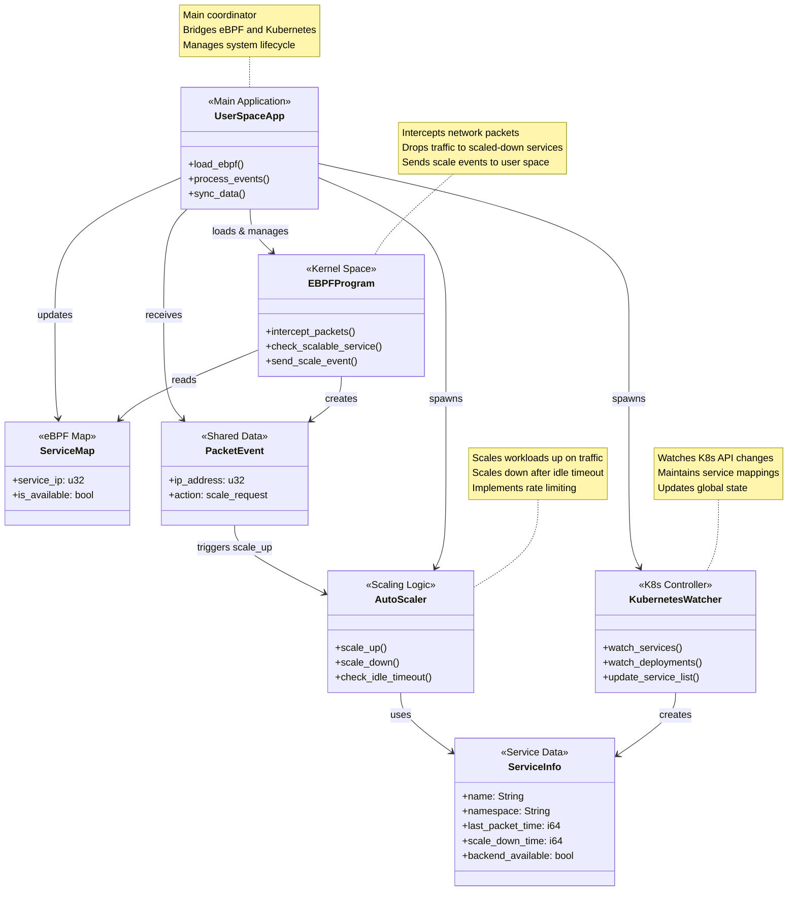
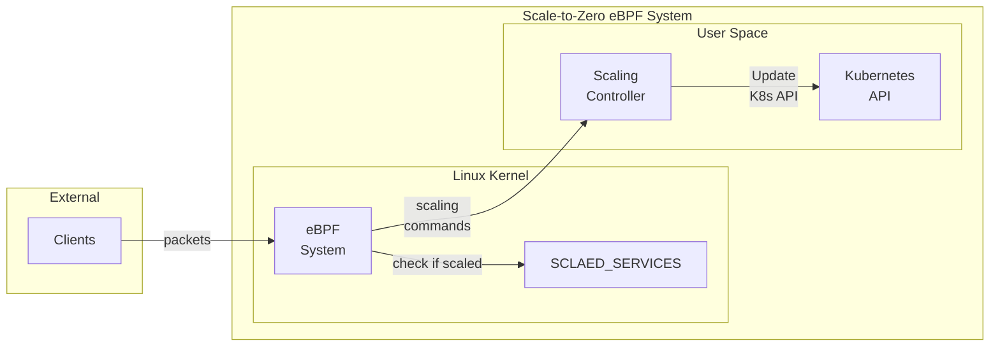

1. Class Diagram



2. DFD diagram

2.1 Context Diagram



```
flowchart TD
    %% External input
    Pkts([Packets])

    %% Processes
    P1[1.0 Intercept<br/>Packets]
    P2[2.0 Manage<br/>Service State]
    P3[3.0 Monitor<br/>Activity]
    P4[4.0 Execute<br/>Scaling Operations]
    P5[5.0 Collect<br/>Metrics]

    %% Data store
    D1[[D1 Service<br/>State Store]]

    %% Data flow arrows
    Pkts --> P1
    P1 -->|lookup| P2
    P2 -->|state| P3
    P1 -->|scaling trigger| P4
    P2 -->|update maps| P5
    P3 -->|idle signal| D1

    %% Optional feedback loops or connections
    P3 -->|update| P2
```

## System Overview

The system consists of:
- **eBPF XDP Programs**: Intercept packets at the network interface level
- **Userspace Controller**: Manages Kubernetes workload scaling
- **Service Discovery**: Tracks services eligible for scale-to-zero
- **HPA Integration**: Sophisticated handling of Horizontal Pod Autoscaler suspension/resumption

## 1. XDP Packet Interception Algorithm

```
Algorithm: XDP_PACKET_INTERCEPTION
Input: Network packet at XDP hook
Output: Packet action (PASS, DROP, or ABORT)

1. PACKET_PARSING:
   a. Extract Ethernet header from packet context
   b. Verify packet is IPv4 (filter non-IPv4 traffic)
   c. Extract IPv4 header and destination IP address
   d. Convert destination IP to host byte order

2. SERVICE_LOOKUP:
   a. Query SERVICE_LIST map using destination IP as key
   b. Retrieve service availability status (0 = scaled down, 1 = available)

3. DECISION_LOGIC:
   IF destination IP NOT in SERVICE_LIST:
       RETURN XDP_PASS  // Non-managed service, forward normally
   
   IF service availability == 0:  // Service scaled to zero
       a. Create PacketLog entry with action=1 (scale-up request)
       b. Send event to userspace via SCALE_REQUESTS perf buffer
       c. RETURN XDP_DROP  // Drop packet to prevent immediate failure
   
   IF service availability == 1:  // Service available
       a. Create PacketLog entry with action=0 (traffic recorded)
       b. Send event to userspace via SCALE_REQUESTS perf buffer  
       c. RETURN XDP_PASS  // Forward packet normally

4. ERROR_HANDLING:
   IF packet parsing fails:
       RETURN XDP_ABORTED
```

**Key Design Decisions:**
- **Early packet filtering**: Only processes IPv4 traffic to reduce overhead
- **Memory-efficient lookups**: Uses eBPF hash maps for O(1) service lookups
- **Stateless operation**: No complex state maintained in kernel space
- **Rate limiting**: Userspace handles rate limiting to prevent scale-up storms

## 2. Scaling Up Algorithm

```
Algorithm: SCALE_UP_ALGORITHM
Input: Service IP address from dropped packet
Output: Service scaled to minimum replicas

1. RATE_LIMITING:
   a. Check LAST_CALLED map for service IP
   b. IF called within last 5 seconds:
       RETURN "Rate Limited"
   c. Update LAST_CALLED timestamp

2. SERVICE_VALIDATION:
   a. Retrieve ServiceData from WATCHED_SERVICES
   b. Verify service exists and is managed
   c. Update backend_available flag to true

3. HPA_AWARE_SCALING:
   IF service.hpa_enabled == true:
       a. CALL HPASuspensionController.suspend_hpa()
       b. Store original min/max replica configuration
       c. Remove HPA constraints temporarily

4. DIRECT_SCALING:
   a. Determine workload type (Deployment or StatefulSet)
   b. PATCH Kubernetes resource with replicas=1
   c. Wait for operation completion

5. HPA_RESTORATION:
   IF service.hpa_enabled == true AND scaling successful:
       a. Wait for pod readiness (optional enhancement)
       b. CALL HPASuspensionController.resume_hpa()
       c. Restore original HPA configuration
       d. Allow HPA to manage further scaling

6. STATE_UPDATE:
   a. Update WATCHED_SERVICES with new availability status
   b. Update SERVICE_LIST eBPF map via userspace sync
   c. Log scaling operation

7. ERROR_HANDLING:
   IF any step fails:
       a. Log error with context
       b. Attempt cleanup of partial state
       c. Mark service as unavailable if necessary
```

**Key Design Principles:**
- **Fast 0→1 scaling**: Direct scaling to 1 replica bypasses HPA constraints
- **HPA coordination**: Suspends HPA during scale-up, then restores for horizontal scaling
- **Rate limiting**: Prevents rapid successive scale-up requests
- **Atomic operations**: Uses Kubernetes patches for reliable state changes

## 3. Scaling Down Algorithm

```
Algorithm: SCALE_DOWN_ALGORITHM
Input: Periodic execution (every 1 second)
Output: Idle services scaled to zero replicas

1. SERVICE_DISCOVERY:
   a. Iterate through all entries in WATCHED_SERVICES
   b. Create snapshot of service states to avoid lock contention

2. IDLE_DETECTION:
   FOR each service in WATCHED_SERVICES:
       a. Calculate idle_time = current_timestamp - last_packet_time
       b. Retrieve configured scale_down_time from service annotations
       
       IF idle_time > scale_down_time AND backend_available == true:
           PROCEED to scaling decision

3. HPA_COORDINATION:
   IF service.hpa_enabled == true:
       a. CALL HPASuspensionController.suspend_hpa()
       b. Store original HPA configuration in annotations
       c. Set HPA min/max replicas to null (suspend HPA)

4. WORKLOAD_SCALING:
   a. Determine workload type (Deployment or StatefulSet)
   b. PATCH Kubernetes resource with replicas=0
   c. Verify scaling operation success

5. STATE_MANAGEMENT:
   a. Set service.backend_available = false
   b. Update WATCHED_SERVICES entry
   c. Sync SERVICE_LIST eBPF map (value = 0 for scaled-down service)
   d. Log scaling operation

6. CONTINUOUS_MONITORING:
   a. Sleep for 1 second interval
   b. REPEAT from step 1

7. RECOVERY_HANDLING:
   IF service receives traffic while scaling down:
       a. Interrupt scale-down process
       b. Update last_packet_time
       c. Maintain backend_available = true
```

**Advanced Features:**
- **Configurable idle timeouts**: Per-service scale-down timing via annotations
- **HPA state preservation**: Stores original HPA configuration for restoration
- **Graceful degradation**: Handles partial failures without affecting other services
- **Conflict resolution**: Packet arrivals during scale-down reset the idle timer

## System Architecture Highlights

### **Data Flow:**
1. **Packet arrives** → XDP program intercepts → Service lookup → Decision
2. **Scale-up event** → Userspace receives → Rate limit → HPA suspend → Scale → HPA resume
3. **Background monitoring** → Idle detection → HPA suspend → Scale to zero

### **State Synchronization:**
- **eBPF ↔ Userspace**: Perf event arrays for real-time packet events
- **Userspace ↔ Kubernetes**: Watch streams for service/workload changes  
- **Memory Maps**: SERVICE_LIST synchronized every 100ms between userspace and eBPF

### **Performance Characteristics:**
- **Packet processing latency**: ~μs (eBPF XDP processing)
- **Scale-up time**: ~1-3 seconds (Kubernetes API + pod startup)
- **Scale-down detection**: 1-second granularity
- **Memory overhead**: O(n) where n = number of managed services

This architecture provides a production-ready scale-to-zero solution with microsecond packet interception latency and intelligent HPA coordination for enterprise Kubernetes environments.